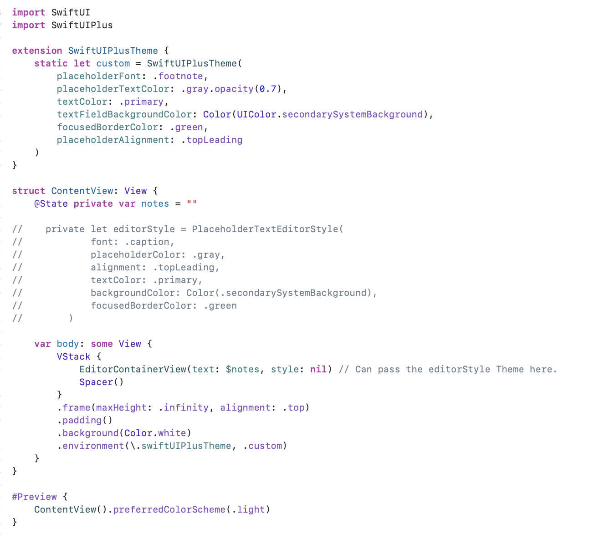

# SwiftUIPlus

Lightweight SwiftUI components with theming support. Built to simplify UI composition while allowing full customization using a unified theme model.

## ✨ Features

- `PlaceholderTextEditor`: A SwiftUI `TextEditor` with placeholder support
- Global theming using `SwiftUIPlusTheme`
- Zero dependencies
- Swift Package Manager ready

## 📦 Installation

Add SwiftUIPlus via [Swift Package Manager](https://swift.org/package-manager/) using this URL: https://github.com/nyeineiei/SwiftUIPlus.git


Or add it in Xcode:

1. Go to **File > Add Packages**
2. Paste the URL: `https://github.com/nyeineiei/SwiftUIPlus.git`
3. Select version/tag or branch (`main`)

## 🧱 Components

### `PlaceholderTextEditor`

A drop-in replacement for `TextEditor` with built-in support for placeholders and theming.

```swift
import SwiftUI
import SwiftUIPlus

struct ExampleView: View {
    @State private var text = ""

    var body: some View {
        PlaceholderTextEditorView(text: $text, placeholder: "Type something...")
            .padding()
            .environment(\.swiftUIPlusTheme, .custom)
    }
}

Or add it in Xcode:

1. Go to **File > Add Packages**
2. Paste the URL: `https://github.com/nyeineiei/SwiftUIPlus.git`
3. Select version/tag or branch (`main`)

## 🧱 Components

### `PlaceholderTextEditor`

A drop-in replacement for `TextEditor` with built-in support for placeholders and theming.

### Example Usage:

